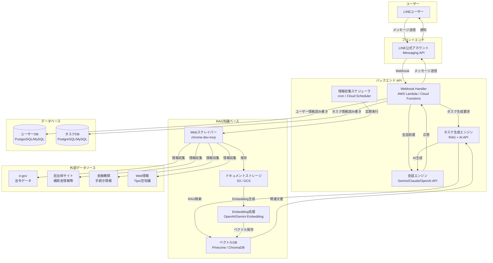

# システムアーキテクチャ設計書

## 1. システム概要

受け継ぐAIは、LINE公式アカウントをフロントエンドとし、バックエンドでAI APIとRAG（Retrieval-Augmented Generation）を活用したタスク管理システムです。

### 1.1 主要な特徴
- LINE Messaging APIによる親しみやすいUI
- RAGベースの知識ベースで個別最適化されたタスク生成
- chrome-dev-mcpによる自動情報収集
- サーバーレスアーキテクチャによる柔軟なスケーリング

---

## 2. 全体構成図



---

## 3. コンポーネント詳細

### 3.1 フロントエンド層

#### 3.1.1 LINE公式アカウント
- **役割**: ユーザーとの接点
- **技術**: LINE Messaging API
- **機能**:
  - メッセージ送受信
  - リッチメニュー（タスク一覧へのショートカット等）
  - Flex Message（タスク表示）
  - プッシュ通知（リマインダー）

---

### 3.2 バックエンドAPI層

#### 3.2.1 Webhook Handler
- **役割**: LINEからのイベントを受信し、適切な処理にルーティング
- **技術**: AWS Lambda / Google Cloud Functions（選定中）
- **言語**: Python / Node.js（選定中）
- **処理フロー**:
  1. LINE Webhookイベント受信
  2. 署名検証
  3. イベントタイプ判定（メッセージ、フォロー等）
  4. 適切なハンドラーへルーティング

#### 3.2.2 会話エンジン
- **役割**: ユーザーとの自然な対話
- **技術**: Gemini API / Claude API / OpenAI API
- **機能**:
  - 初回ヒアリングの実施
  - タスクに関する質問への回答
  - 補足情報の提供
  - 会話履歴の管理（コンテキスト保持）

#### 3.2.3 タスク生成エンジン
- **役割**: ユーザー固有のタスクを生成
- **技術**: RAG + AI API
- **処理フロー**:
  1. ヒアリング情報の構造化
  2. RAGで関連知識を検索（法令、自治体情報等）
  3. AI APIでタスクリストを生成
  4. 優先順位・期限の付与
  5. データベースへ保存
- **出力**:
  - タスクID
  - タスク名
  - 説明
  - 期限
  - 優先順位
  - 関連リンク

#### 3.2.4 情報収集スケジューラ
- **役割**: 定期的に外部情報を収集・更新
- **技術**: cron / AWS EventBridge / Google Cloud Scheduler
- **実行頻度**: 週次 / 月次（データソースにより異なる）
- **処理内容**:
  1. chrome-dev-mcpを起動
  2. 対象サイトから情報収集
  3. 差分検知
  4. 新規/更新データをストレージに保存
  5. Embedding生成・ベクトルDB更新

---

### 3.3 RAG知識ベース層

#### 3.3.1 Webスクレイパー
- **役割**: APIのないWebサイトから情報収集
- **技術**: chrome-dev-mcp
- **対象**:
  - 自治体Webサイト（補助金、手続き情報）
  - 金融機関サイト
  - 保険会社サイト
  - e-gov（法令データ）
- **処理**:
  - HTML解析
  - PDF抽出・OCR
  - 構造化データへの変換

#### 3.3.2 ドキュメントストレージ
- **役割**: 収集した情報の保管
- **技術**: AWS S3 / Google Cloud Storage
- **データ形式**: Markdown / JSON
- **ディレクトリ構成例**:
  ```
  /documents
    /laws          # 法令データ
    /municipalities # 自治体情報
    /financial      # 金融機関情報
    /tips           # Tips・豆知識
  ```

#### 3.3.3 Embedding処理
- **役割**: テキストをベクトル化
- **技術**: OpenAI Embedding API / Gemini Embedding API
- **モデル**: text-embedding-3-small / text-embedding-004（選定中）
- **処理**:
  1. ドキュメントをチャンク分割（1000トークン程度）
  2. 各チャンクをEmbedding化
  3. メタデータ付与（ソース、日付等）
  4. ベクトルDBへ保存

#### 3.3.4 ベクトルDB
- **役割**: ベクトルの保存と類似検索
- **技術**: Pinecone（無料枠） / ChromaDB（オープンソース）
- **機能**:
  - 高速な類似度検索（コサイン類似度）
  - メタデータフィルタリング
  - ハイブリッド検索（テキスト+ベクトル）

---

### 3.4 データベース層

#### 3.4.1 ユーザーDB
- **技術**: PostgreSQL / MySQL（選定中）
- **テーブル**:
  - users（ユーザー情報）
  - user_profiles（ヒアリング情報）
  - subscriptions（サブスクリプション情報）

#### 3.4.2 タスクDB
- **技術**: PostgreSQL / MySQL（選定中）
- **テーブル**:
  - tasks（タスク情報）
  - task_progress（進捗記録）
  - reminders（リマインダー）

---

## 4. データフロー

### 4.1 初回ヒアリングフロー

```
1. ユーザーがLINE友達追加
2. LINE → Webhook Handler（フォローイベント）
3. Webhook → 会話エンジン（ヒアリング開始）
4. 会話エンジン → LINE（質問送信）
5. ユーザー → LINE → Webhook（回答）
6. Webhook → ユーザーDB（情報保存）
7. 全質問完了後 → タスク生成エンジン起動
```

### 4.2 タスク生成フロー

```
1. タスク生成エンジン起動
2. ユーザーDBからヒアリング情報取得
3. ベクトルDBで関連情報検索
   - 続柄、居住地、死亡日等をクエリ化
   - Top-K件の関連文書を取得
4. AI APIでタスク生成
   - プロンプト: ヒアリング情報 + 関連文書
   - 出力: タスクリスト（JSON形式）
5. タスクDBに保存
6. LINE経由でユーザーへ通知
```

### 4.3 タスク完了報告フロー

```
1. ユーザー → LINE（「タスク1完了」）
2. LINE → Webhook Handler
3. Webhook → タスクDB（ステータス更新）
4. Webhook → 次タスク取得
5. LINE経由でユーザーへ次タスク提示
```

### 4.4 情報収集・更新フロー

```
1. スケジューラ起動（週次/月次）
2. Webスクレイパー起動
3. 対象サイトから情報収集
4. ドキュメントストレージに保存
5. Embedding処理
6. ベクトルDBに保存・更新
7. 更新ログ記録
```

---

## 5. 技術スタック詳細

### 5.1 開発言語
- **バックエンド**: Python（推奨）
  - 理由: AI/ML系ライブラリの充実、chrome-dev-mcp対応
- **代替**: Node.js（TypeScript）

### 5.2 フレームワーク
- **Python**: FastAPI / Flask
- **Node.js**: Express.js

### 5.3 インフラ
- **クラウド**: AWS / GCP（選定中）
- **サーバーレス**: AWS Lambda / Google Cloud Functions
- **スケジューラ**: AWS EventBridge / Google Cloud Scheduler
- **ストレージ**: AWS S3 / Google Cloud Storage
- **データベース**: Amazon RDS (PostgreSQL) / Cloud SQL (PostgreSQL)

### 5.4 AI API
- **会話AI**: Gemini 1.5 Flash（無料枠優先）/ GPT-4o-mini / Claude 3.5 Haiku
- **Embedding**: OpenAI text-embedding-3-small / Gemini text-embedding-004

### 5.5 ベクトルDB
- **選択肢1**: Pinecone（無料枠: 1インデックス、5GB）
- **選択肢2**: ChromaDB（オープンソース、自前ホスティング）

### 5.6 その他ツール
- **Webスクレイピング**: chrome-dev-mcp
- **決済**: Stripe
- **監視**: CloudWatch / Cloud Logging
- **CI/CD**: GitHub Actions

---

## 6. 非機能要件への対応

### 6.1 セキュリティ
- **通信の暗号化**: HTTPS/TLS
- **認証**: LINE署名検証、API Key管理（環境変数）
- **個人情報保護**: データベース暗号化、アクセス制御

### 6.2 パフォーマンス
- **応答時間**:
  - Webhook応答: 3秒以内（LINE要件）
  - タスク生成: 10秒以内
- **最適化**:
  - Lambda/Cloud Functionsのウォームアップ
  - ベクトルDB検索の高速化
  - キャッシング（Redis検討）

### 6.3 スケーラビリティ
- サーバーレスアーキテクチャによる自動スケーリング
- データベースのリードレプリカ（必要に応じて）
- ベクトルDBのインデックス分割（ユーザー増加時）

### 6.4 可用性
- **目標**: 99%以上
- **施策**:
  - マルチAZ配置（RDS等）
  - Lambda/Cloud Functionsの冗長性（デフォルト）
  - 監視・アラート設定

### 6.5 保守性
- **ログ管理**: CloudWatch Logs / Cloud Logging
- **エラー追跡**: Sentry（検討）
- **バージョン管理**: Git / GitHub
- **IaC**: Terraform / CloudFormation（検討）

---

## 7. 技術選定の方針

### 7.1 クラウドプロバイダ選定基準
| 項目 | AWS | GCP |
|------|-----|-----|
| 無料枠 | Lambda 100万リクエスト/月 | Cloud Functions 200万リクエスト/月 |
| AI API連携 | Bedrock（Claude等） | Vertex AI（Gemini） |
| コスト | やや高め | やや安め |
| 学習コスト | 高い | 中程度 |

**推奨**: GCP（Gemini連携が容易、無料枠が大きい）

### 7.2 AI API選定基準
| API | コスト | 品質 | 無料枠 | 推奨度 |
|-----|--------|------|--------|--------|
| Gemini 1.5 Flash | 低 | 高 | 大 | ★★★ |
| GPT-4o-mini | 中 | 高 | 小 | ★★ |
| Claude 3.5 Haiku | 中 | 高 | 小 | ★★ |

**推奨**: Gemini 1.5 Flash（コストとバランス）

### 7.3 ベクトルDB選定基準
| DB | コスト | 性能 | 管理負担 | 推奨度 |
|----|--------|------|----------|--------|
| Pinecone | 無料枠あり | 高 | 低 | ★★★ |
| ChromaDB | 無料 | 中 | 高 | ★★ |

**推奨**: Pinecone（管理が容易、無料枠で開始可能）

---

## 8. 開発フェーズ

### Phase 1: MVP（最小機能）
- LINE友達追加・ヒアリング機能
- 簡易タスク生成（RAGなし、ルールベース）
- タスク一覧表示・完了報告

### Phase 2: RAG導入
- Webスクレイパー実装
- ベクトルDB構築
- RAGベースのタスク生成

### Phase 3: 自動化・拡張
- 情報収集の自動化
- 補助金情報提示
- リマインダー機能

### Phase 4: ビジネス化
- 決済機能（Stripe）
- ユーザー管理強化
- 専門家マッチング機能

---

## 付録

### 改訂履歴
| バージョン | 日付 | 変更内容 | 変更者 |
|---------|------|---------|--------|
| 1.0 | 2025-10-05 | 初版作成 | - |

---
作成日: 2025-10-05
最終更新: 2025-10-05
