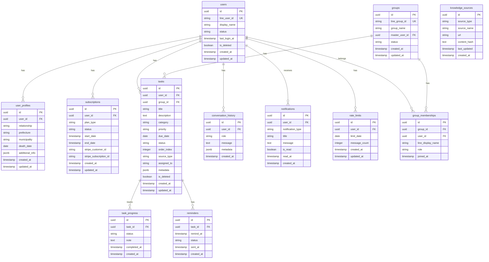

# データベース設計書

## 1. 概要

### 1.1 データベース種別
- **DBMS**: PostgreSQL 15+
- **環境**: Google Cloud SQL
- **文字コード**: UTF-8
- **タイムゾーン**: Asia/Tokyo

### 1.2 設計方針
- 正規化を基本とし、パフォーマンスが必要な箇所のみ非正規化を検討
- 外部キー制約による参照整合性の確保
- インデックスによる検索パフォーマンスの最適化
- 論理削除（soft delete）の採用（ユーザー・タスク等）
- タイムスタンプ（created_at, updated_at）の全テーブル付与

---

## 2. ER図



---

## 3. テーブル定義

### 3.1 users（ユーザー）

**概要**: LINEユーザーの基本情報を管理

| カラム名 | 型 | NULL | デフォルト | 説明 |
|---------|-----|------|-----------|------|
| id | UUID | NOT NULL | uuid_generate_v4() | 主キー |
| line_user_id | VARCHAR(255) | NOT NULL | - | LINE User ID（一意） |
| display_name | VARCHAR(255) | NULL | - | LINE表示名 |
| status | VARCHAR(50) | NOT NULL | 'active' | ユーザーステータス（active, inactive, deleted） |
| last_login_at | TIMESTAMP | NULL | - | 最終ログイン日時 |
| is_deleted | BOOLEAN | NOT NULL | false | 論理削除フラグ |
| created_at | TIMESTAMP | NOT NULL | CURRENT_TIMESTAMP | 作成日時 |
| updated_at | TIMESTAMP | NOT NULL | CURRENT_TIMESTAMP | 更新日時 |

**制約**:
- PRIMARY KEY: id
- UNIQUE KEY: line_user_id

**インデックス**:
- `idx_users_line_user_id` ON line_user_id
- `idx_users_status` ON status WHERE is_deleted = false

---

### 3.2 user_profiles（ユーザープロフィール）

**概要**: ヒアリング情報を保存

| カラム名 | 型 | NULL | デフォルト | 説明 |
|---------|-----|------|-----------|------|
| id | UUID | NOT NULL | uuid_generate_v4() | 主キー |
| user_id | UUID | NOT NULL | - | ユーザーID（外部キー） |
| relationship | VARCHAR(50) | NULL | - | 続柄（father, mother, spouse等） |
| prefecture | VARCHAR(50) | NULL | - | 都道府県 |
| municipality | VARCHAR(100) | NULL | - | 市町村 |
| death_date | DATE | NULL | - | 死亡日 |
| additional_info | JSONB | NULL | - | その他の情報（柔軟に拡張可能） |
| created_at | TIMESTAMP | NOT NULL | CURRENT_TIMESTAMP | 作成日時 |
| updated_at | TIMESTAMP | NOT NULL | CURRENT_TIMESTAMP | 更新日時 |

**制約**:
- PRIMARY KEY: id
- FOREIGN KEY: user_id REFERENCES users(id) ON DELETE CASCADE

**インデックス**:
- `idx_user_profiles_user_id` ON user_id

**additional_info の想定構造（JSONB）**:
```json
{
  "family_members": ["spouse", "child1", "child2"],
  "financial_institutions": ["bank_a", "bank_b"],
  "has_real_estate": true,
  "custom_notes": "その他特記事項"
}
```

---

### 3.3 subscriptions（サブスクリプション）

**概要**: サブスクリプション情報を管理

| カラム名 | 型 | NULL | デフォルト | 説明 |
|---------|-----|------|-----------|------|
| id | UUID | NOT NULL | uuid_generate_v4() | 主キー |
| user_id | UUID | NOT NULL | - | ユーザーID（外部キー） |
| plan_type | VARCHAR(50) | NOT NULL | - | プランタイプ（beta, standard等） |
| status | VARCHAR(50) | NOT NULL | - | ステータス（active, canceled, expired） |
| start_date | TIMESTAMP | NOT NULL | - | 開始日時 |
| end_date | TIMESTAMP | NULL | - | 終了日時 |
| stripe_customer_id | VARCHAR(255) | NULL | - | Stripe顧客ID |
| stripe_subscription_id | VARCHAR(255) | NULL | - | StripeサブスクリプションID |
| created_at | TIMESTAMP | NOT NULL | CURRENT_TIMESTAMP | 作成日時 |
| updated_at | TIMESTAMP | NOT NULL | CURRENT_TIMESTAMP | 更新日時 |

**制約**:
- PRIMARY KEY: id
- FOREIGN KEY: user_id REFERENCES users(id) ON DELETE CASCADE

**インデックス**:
- `idx_subscriptions_user_id` ON user_id
- `idx_subscriptions_status` ON status
- `idx_subscriptions_stripe_customer_id` ON stripe_customer_id

---

### 3.4 tasks（タスク）

**概要**: ユーザーごとのタスク情報を管理（個人・グループ両対応）

| カラム名 | 型 | NULL | デフォルト | 説明 |
|---------|-----|------|-----------|------|
| id | UUID | NOT NULL | uuid_generate_v4() | 主キー |
| user_id | UUID | NULL | - | ユーザーID（外部キー）※個人タスクの場合のみ |
| group_id | UUID | NULL | - | グループID（外部キー）※グループタスクの場合のみ |
| title | VARCHAR(255) | NOT NULL | - | タスク名 |
| description | TEXT | NULL | - | タスク詳細 |
| category | VARCHAR(100) | NULL | - | カテゴリ（death_certificate, pension, tax等） |
| priority | VARCHAR(20) | NOT NULL | 'medium' | 優先度（high, medium, low） |
| due_date | DATE | NULL | - | 期限 |
| status | VARCHAR(50) | NOT NULL | 'pending' | ステータス（pending, in_progress, completed, skipped） |
| order_index | INTEGER | NOT NULL | 0 | 表示順序 |
| source_type | VARCHAR(20) | NOT NULL | 'ai_generated' | タスク生成元（ai_generated, user_created） |
| assigned_to | VARCHAR(255) | NULL | - | 担当者（グループタスクの場合、LINEアカウント名） |
| metadata | JSONB | NULL | - | メタデータ（関連リンク、補足情報等） |
| is_deleted | BOOLEAN | NOT NULL | false | 論理削除フラグ |
| created_at | TIMESTAMP | NOT NULL | CURRENT_TIMESTAMP | 作成日時 |
| updated_at | TIMESTAMP | NOT NULL | CURRENT_TIMESTAMP | 更新日時 |

**制約**:
- PRIMARY KEY: id
- FOREIGN KEY: user_id REFERENCES users(id) ON DELETE CASCADE
- FOREIGN KEY: group_id REFERENCES groups(id) ON DELETE CASCADE
- CHECK: (user_id IS NOT NULL AND group_id IS NULL) OR (user_id IS NULL AND group_id IS NOT NULL)

**インデックス**:
- `idx_tasks_user_id` ON user_id WHERE is_deleted = false
- `idx_tasks_group_id` ON group_id WHERE is_deleted = false
- `idx_tasks_status` ON status WHERE is_deleted = false
- `idx_tasks_due_date` ON due_date WHERE is_deleted = false
- `idx_tasks_order_user` ON user_id, order_index WHERE is_deleted = false AND user_id IS NOT NULL
- `idx_tasks_order_group` ON group_id, order_index WHERE is_deleted = false AND group_id IS NOT NULL
- `idx_tasks_source_type` ON source_type WHERE is_deleted = false

**metadata の想定構造（JSONB）**:
```json
{
  "related_links": [
    {"title": "市役所HP", "url": "https://..."}
  ],
  "estimated_duration": "30分",
  "required_documents": ["死亡診断書", "戸籍謄本"],
  "subsidy_info": {
    "name": "葬祭費",
    "amount": 50000
  }
}
```

---

### 3.5 task_progress（タスク進捗）

**概要**: タスクの進捗履歴を記録

| カラム名 | 型 | NULL | デフォルト | 説明 |
|---------|-----|------|-----------|------|
| id | UUID | NOT NULL | uuid_generate_v4() | 主キー |
| task_id | UUID | NOT NULL | - | タスクID（外部キー） |
| status | VARCHAR(50) | NOT NULL | - | ステータス（started, completed, skipped） |
| note | TEXT | NULL | - | メモ |
| completed_at | TIMESTAMP | NULL | - | 完了日時 |
| created_at | TIMESTAMP | NOT NULL | CURRENT_TIMESTAMP | 作成日時 |

**制約**:
- PRIMARY KEY: id
- FOREIGN KEY: task_id REFERENCES tasks(id) ON DELETE CASCADE

**インデックス**:
- `idx_task_progress_task_id` ON task_id
- `idx_task_progress_created_at` ON created_at

---

### 3.6 reminders（リマインダー）

**概要**: タスクのリマインダー情報を管理

| カラム名 | 型 | NULL | デフォルト | 説明 |
|---------|-----|------|-----------|------|
| id | UUID | NOT NULL | uuid_generate_v4() | 主キー |
| task_id | UUID | NOT NULL | - | タスクID（外部キー） |
| remind_at | TIMESTAMP | NOT NULL | - | リマインド日時 |
| status | VARCHAR(50) | NOT NULL | 'pending' | ステータス（pending, sent, canceled） |
| sent_at | TIMESTAMP | NULL | - | 送信日時 |
| created_at | TIMESTAMP | NOT NULL | CURRENT_TIMESTAMP | 作成日時 |

**制約**:
- PRIMARY KEY: id
- FOREIGN KEY: task_id REFERENCES tasks(id) ON DELETE CASCADE

**インデックス**:
- `idx_reminders_task_id` ON task_id
- `idx_reminders_remind_at` ON remind_at WHERE status = 'pending'

---

### 3.7 conversation_history（会話履歴）

**概要**: ユーザーとの会話履歴を保存（AI応答の品質向上に活用）

| カラム名 | 型 | NULL | デフォルト | 説明 |
|---------|-----|------|-----------|------|
| id | UUID | NOT NULL | uuid_generate_v4() | 主キー |
| user_id | UUID | NOT NULL | - | ユーザーID（外部キー） |
| role | VARCHAR(20) | NOT NULL | - | 役割（user, assistant, system） |
| message | TEXT | NOT NULL | - | メッセージ内容 |
| metadata | JSONB | NULL | - | メタデータ（トークン数、モデル名等） |
| created_at | TIMESTAMP | NOT NULL | CURRENT_TIMESTAMP | 作成日時 |

**制約**:
- PRIMARY KEY: id
- FOREIGN KEY: user_id REFERENCES users(id) ON DELETE CASCADE

**インデックス**:
- `idx_conversation_history_user_id` ON user_id
- `idx_conversation_history_created_at` ON created_at

**保存期間**: 直近1ヶ月（古いデータは定期削除）

---

### 3.8 notifications（通知）

**概要**: ユーザーへの通知情報を管理

| カラム名 | 型 | NULL | デフォルト | 説明 |
|---------|-----|------|-----------|------|
| id | UUID | NOT NULL | uuid_generate_v4() | 主キー |
| user_id | UUID | NOT NULL | - | ユーザーID（外部キー） |
| notification_type | VARCHAR(50) | NOT NULL | - | 通知タイプ（reminder, system, update） |
| title | VARCHAR(255) | NOT NULL | - | 通知タイトル |
| message | TEXT | NOT NULL | - | 通知メッセージ |
| is_read | BOOLEAN | NOT NULL | false | 既読フラグ |
| read_at | TIMESTAMP | NULL | - | 既読日時 |
| created_at | TIMESTAMP | NOT NULL | CURRENT_TIMESTAMP | 作成日時 |

**制約**:
- PRIMARY KEY: id
- FOREIGN KEY: user_id REFERENCES users(id) ON DELETE CASCADE

**インデックス**:
- `idx_notifications_user_id` ON user_id WHERE is_read = false
- `idx_notifications_created_at` ON created_at

---

### 3.9 knowledge_sources（知識ソース管理）

**概要**: RAG用の知識ソース情報を管理

| カラム名 | 型 | NULL | デフォルト | 説明 |
|---------|-----|------|-----------|------|
| id | UUID | NOT NULL | uuid_generate_v4() | 主キー |
| source_type | VARCHAR(50) | NOT NULL | - | ソース種別（law, municipality, financial, tips） |
| source_name | VARCHAR(255) | NOT NULL | - | ソース名（例: 東京都千代田区） |
| url | TEXT | NULL | - | 元URL |
| content_hash | TEXT | NOT NULL | - | コンテンツハッシュ（差分検知用） |
| last_updated | TIMESTAMP | NOT NULL | - | 最終更新日時 |
| created_at | TIMESTAMP | NOT NULL | CURRENT_TIMESTAMP | 作成日時 |

**制約**:
- PRIMARY KEY: id
- UNIQUE KEY: source_type, source_name

**インデックス**:
- `idx_knowledge_sources_source_type` ON source_type
- `idx_knowledge_sources_last_updated` ON last_updated

**備考**: 実際のドキュメントは Cloud Storage に保存し、メタデータのみDBで管理

---

### 3.10 groups（グループ）【Phase 3】

**概要**: LINEグループ情報を管理

| カラム名 | 型 | NULL | デフォルト | 説明 |
|---------|-----|------|-----------|------|
| id | UUID | NOT NULL | uuid_generate_v4() | 主キー |
| line_group_id | VARCHAR(255) | NOT NULL | - | LINE Group ID（一意） |
| group_name | VARCHAR(255) | NULL | - | グループ名 |
| master_user_id | UUID | NOT NULL | - | マスターアカウント（課金ユーザー）のID |
| status | VARCHAR(50) | NOT NULL | 'active' | ステータス（active, inactive） |
| created_at | TIMESTAMP | NOT NULL | CURRENT_TIMESTAMP | 作成日時 |
| updated_at | TIMESTAMP | NOT NULL | CURRENT_TIMESTAMP | 更新日時 |

**制約**:
- PRIMARY KEY: id
- UNIQUE KEY: line_group_id
- FOREIGN KEY: master_user_id REFERENCES users(id) ON DELETE CASCADE

**インデックス**:
- `idx_groups_line_group_id` ON line_group_id
- `idx_groups_master_user_id` ON master_user_id

---

### 3.11 group_memberships（グループメンバーシップ）【Phase 3】

**概要**: グループとユーザーの紐付けを管理

| カラム名 | 型 | NULL | デフォルト | 説明 |
|---------|-----|------|-----------|------|
| id | UUID | NOT NULL | uuid_generate_v4() | 主キー |
| group_id | UUID | NOT NULL | - | グループID（外部キー） |
| user_id | UUID | NOT NULL | - | ユーザーID（外部キー） |
| line_display_name | VARCHAR(255) | NULL | - | LINEでの表示名 |
| role | VARCHAR(50) | NOT NULL | 'member' | 役割（master, member） |
| joined_at | TIMESTAMP | NOT NULL | CURRENT_TIMESTAMP | 参加日時 |

**制約**:
- PRIMARY KEY: id
- FOREIGN KEY: group_id REFERENCES groups(id) ON DELETE CASCADE
- FOREIGN KEY: user_id REFERENCES users(id) ON DELETE CASCADE
- UNIQUE KEY: group_id, user_id

**インデックス**:
- `idx_group_memberships_group_id` ON group_id
- `idx_group_memberships_user_id` ON user_id

---

### 3.12 rate_limits（レート制限）【Phase 1】

**概要**: ユーザーごとのメッセージポスト制限を管理

| カラム名 | 型 | NULL | デフォルト | 説明 |
|---------|-----|------|-----------|------|
| id | UUID | NOT NULL | uuid_generate_v4() | 主キー |
| user_id | UUID | NOT NULL | - | ユーザーID（外部キー） |
| limit_date | DATE | NOT NULL | - | 制限対象日（YYYY-MM-DD） |
| message_count | INTEGER | NOT NULL | 0 | メッセージ送信回数 |
| created_at | TIMESTAMP | NOT NULL | CURRENT_TIMESTAMP | 作成日時 |
| updated_at | TIMESTAMP | NOT NULL | CURRENT_TIMESTAMP | 更新日時 |

**制約**:
- PRIMARY KEY: id
- FOREIGN KEY: user_id REFERENCES users(id) ON DELETE CASCADE
- UNIQUE KEY: user_id, limit_date

**インデックス**:
- `idx_rate_limits_user_date` ON user_id, limit_date
- `idx_rate_limits_date` ON limit_date

**運用**:
- 前日以前のレコードは定期削除（保持期間: 7日間）
- message_count が 100 を超えた場合、制限メッセージを返す

---

## 4. マスタデータ

### 4.1 続柄マスタ（アプリケーション側で管理）

```python
RELATIONSHIPS = {
    'father': '父',
    'mother': '母',
    'spouse': '配偶者',
    'child': '子',
    'grandparent': '祖父母',
    'sibling': '兄弟姉妹',
    'other': 'その他'
}
```

### 4.2 都道府県・市町村マスタ

- 全国地方公共団体コード（総務省）を利用
- JSON/CSVで管理し、アプリケーション側でロード
- 定期的に更新（市町村合併等に対応）

### 4.3 タスクカテゴリマスタ

```python
TASK_CATEGORIES = {
    'death_certificate': '死亡届・死亡診断書',
    'funeral': '葬儀関連',
    'pension': '年金手続き',
    'health_insurance': '健康保険',
    'tax': '税金関連',
    'inheritance': '相続手続き',
    'utilities': '公共料金・契約',
    'financial': '金融機関',
    'real_estate': '不動産',
    'other': 'その他'
}
```

---

## 5. DDL（テーブル作成SQL）

### 5.1 拡張機能の有効化

```sql
-- UUID生成用
CREATE EXTENSION IF NOT EXISTS "uuid-ossp";
```

### 5.2 users テーブル

```sql
CREATE TABLE users (
    id UUID PRIMARY KEY DEFAULT uuid_generate_v4(),
    line_user_id VARCHAR(255) NOT NULL UNIQUE,
    display_name VARCHAR(255),
    status VARCHAR(50) NOT NULL DEFAULT 'active',
    last_login_at TIMESTAMP,
    is_deleted BOOLEAN NOT NULL DEFAULT false,
    created_at TIMESTAMP NOT NULL DEFAULT CURRENT_TIMESTAMP,
    updated_at TIMESTAMP NOT NULL DEFAULT CURRENT_TIMESTAMP
);

CREATE INDEX idx_users_line_user_id ON users(line_user_id);
CREATE INDEX idx_users_status ON users(status) WHERE is_deleted = false;

-- updated_at 自動更新トリガー
CREATE OR REPLACE FUNCTION update_updated_at_column()
RETURNS TRIGGER AS $$
BEGIN
    NEW.updated_at = CURRENT_TIMESTAMP;
    RETURN NEW;
END;
$$ LANGUAGE plpgsql;

CREATE TRIGGER update_users_updated_at BEFORE UPDATE ON users
FOR EACH ROW EXECUTE FUNCTION update_updated_at_column();
```

### 5.3 user_profiles テーブル

```sql
CREATE TABLE user_profiles (
    id UUID PRIMARY KEY DEFAULT uuid_generate_v4(),
    user_id UUID NOT NULL REFERENCES users(id) ON DELETE CASCADE,
    relationship VARCHAR(50),
    prefecture VARCHAR(50),
    municipality VARCHAR(100),
    death_date DATE,
    additional_info JSONB,
    created_at TIMESTAMP NOT NULL DEFAULT CURRENT_TIMESTAMP,
    updated_at TIMESTAMP NOT NULL DEFAULT CURRENT_TIMESTAMP
);

CREATE INDEX idx_user_profiles_user_id ON user_profiles(user_id);

CREATE TRIGGER update_user_profiles_updated_at BEFORE UPDATE ON user_profiles
FOR EACH ROW EXECUTE FUNCTION update_updated_at_column();
```

### 5.4 subscriptions テーブル

```sql
CREATE TABLE subscriptions (
    id UUID PRIMARY KEY DEFAULT uuid_generate_v4(),
    user_id UUID NOT NULL REFERENCES users(id) ON DELETE CASCADE,
    plan_type VARCHAR(50) NOT NULL,
    status VARCHAR(50) NOT NULL,
    start_date TIMESTAMP NOT NULL,
    end_date TIMESTAMP,
    stripe_customer_id VARCHAR(255),
    stripe_subscription_id VARCHAR(255),
    created_at TIMESTAMP NOT NULL DEFAULT CURRENT_TIMESTAMP,
    updated_at TIMESTAMP NOT NULL DEFAULT CURRENT_TIMESTAMP
);

CREATE INDEX idx_subscriptions_user_id ON subscriptions(user_id);
CREATE INDEX idx_subscriptions_status ON subscriptions(status);
CREATE INDEX idx_subscriptions_stripe_customer_id ON subscriptions(stripe_customer_id);

CREATE TRIGGER update_subscriptions_updated_at BEFORE UPDATE ON subscriptions
FOR EACH ROW EXECUTE FUNCTION update_updated_at_column();
```

### 5.5 tasks テーブル

```sql
CREATE TABLE tasks (
    id UUID PRIMARY KEY DEFAULT uuid_generate_v4(),
    user_id UUID REFERENCES users(id) ON DELETE CASCADE,
    group_id UUID REFERENCES groups(id) ON DELETE CASCADE,
    title VARCHAR(255) NOT NULL,
    description TEXT,
    category VARCHAR(100),
    priority VARCHAR(20) NOT NULL DEFAULT 'medium',
    due_date DATE,
    status VARCHAR(50) NOT NULL DEFAULT 'pending',
    order_index INTEGER NOT NULL DEFAULT 0,
    source_type VARCHAR(20) NOT NULL DEFAULT 'ai_generated',
    assigned_to VARCHAR(255),
    metadata JSONB,
    is_deleted BOOLEAN NOT NULL DEFAULT false,
    created_at TIMESTAMP NOT NULL DEFAULT CURRENT_TIMESTAMP,
    updated_at TIMESTAMP NOT NULL DEFAULT CURRENT_TIMESTAMP,
    CONSTRAINT tasks_owner_check CHECK (
        (user_id IS NOT NULL AND group_id IS NULL) OR
        (user_id IS NULL AND group_id IS NOT NULL)
    )
);

CREATE INDEX idx_tasks_user_id ON tasks(user_id) WHERE is_deleted = false;
CREATE INDEX idx_tasks_group_id ON tasks(group_id) WHERE is_deleted = false;
CREATE INDEX idx_tasks_status ON tasks(status) WHERE is_deleted = false;
CREATE INDEX idx_tasks_due_date ON tasks(due_date) WHERE is_deleted = false;
CREATE INDEX idx_tasks_order_user ON tasks(user_id, order_index) WHERE is_deleted = false AND user_id IS NOT NULL;
CREATE INDEX idx_tasks_order_group ON tasks(group_id, order_index) WHERE is_deleted = false AND group_id IS NOT NULL;
CREATE INDEX idx_tasks_source_type ON tasks(source_type) WHERE is_deleted = false;

CREATE TRIGGER update_tasks_updated_at BEFORE UPDATE ON tasks
FOR EACH ROW EXECUTE FUNCTION update_updated_at_column();
```

### 5.6 task_progress テーブル

```sql
CREATE TABLE task_progress (
    id UUID PRIMARY KEY DEFAULT uuid_generate_v4(),
    task_id UUID NOT NULL REFERENCES tasks(id) ON DELETE CASCADE,
    status VARCHAR(50) NOT NULL,
    note TEXT,
    completed_at TIMESTAMP,
    created_at TIMESTAMP NOT NULL DEFAULT CURRENT_TIMESTAMP
);

CREATE INDEX idx_task_progress_task_id ON task_progress(task_id);
CREATE INDEX idx_task_progress_created_at ON task_progress(created_at);
```

### 5.7 reminders テーブル

```sql
CREATE TABLE reminders (
    id UUID PRIMARY KEY DEFAULT uuid_generate_v4(),
    task_id UUID NOT NULL REFERENCES tasks(id) ON DELETE CASCADE,
    remind_at TIMESTAMP NOT NULL,
    status VARCHAR(50) NOT NULL DEFAULT 'pending',
    sent_at TIMESTAMP,
    created_at TIMESTAMP NOT NULL DEFAULT CURRENT_TIMESTAMP
);

CREATE INDEX idx_reminders_task_id ON reminders(task_id);
CREATE INDEX idx_reminders_remind_at ON reminders(remind_at) WHERE status = 'pending';
```

### 5.8 conversation_history テーブル

```sql
CREATE TABLE conversation_history (
    id UUID PRIMARY KEY DEFAULT uuid_generate_v4(),
    user_id UUID NOT NULL REFERENCES users(id) ON DELETE CASCADE,
    role VARCHAR(20) NOT NULL,
    message TEXT NOT NULL,
    metadata JSONB,
    created_at TIMESTAMP NOT NULL DEFAULT CURRENT_TIMESTAMP
);

CREATE INDEX idx_conversation_history_user_id ON conversation_history(user_id);
CREATE INDEX idx_conversation_history_created_at ON conversation_history(created_at);
```

### 5.9 notifications テーブル

```sql
CREATE TABLE notifications (
    id UUID PRIMARY KEY DEFAULT uuid_generate_v4(),
    user_id UUID NOT NULL REFERENCES users(id) ON DELETE CASCADE,
    notification_type VARCHAR(50) NOT NULL,
    title VARCHAR(255) NOT NULL,
    message TEXT NOT NULL,
    is_read BOOLEAN NOT NULL DEFAULT false,
    read_at TIMESTAMP,
    created_at TIMESTAMP NOT NULL DEFAULT CURRENT_TIMESTAMP
);

CREATE INDEX idx_notifications_user_id ON notifications(user_id) WHERE is_read = false;
CREATE INDEX idx_notifications_created_at ON notifications(created_at);
```

### 5.10 knowledge_sources テーブル

```sql
CREATE TABLE knowledge_sources (
    id UUID PRIMARY KEY DEFAULT uuid_generate_v4(),
    source_type VARCHAR(50) NOT NULL,
    source_name VARCHAR(255) NOT NULL,
    url TEXT,
    content_hash TEXT NOT NULL,
    last_updated TIMESTAMP NOT NULL,
    created_at TIMESTAMP NOT NULL DEFAULT CURRENT_TIMESTAMP,
    UNIQUE(source_type, source_name)
);

CREATE INDEX idx_knowledge_sources_source_type ON knowledge_sources(source_type);
CREATE INDEX idx_knowledge_sources_last_updated ON knowledge_sources(last_updated);
```

### 5.11 groups テーブル【Phase 3】

```sql
CREATE TABLE groups (
    id UUID PRIMARY KEY DEFAULT uuid_generate_v4(),
    line_group_id VARCHAR(255) NOT NULL UNIQUE,
    group_name VARCHAR(255),
    master_user_id UUID NOT NULL REFERENCES users(id) ON DELETE CASCADE,
    status VARCHAR(50) NOT NULL DEFAULT 'active',
    created_at TIMESTAMP NOT NULL DEFAULT CURRENT_TIMESTAMP,
    updated_at TIMESTAMP NOT NULL DEFAULT CURRENT_TIMESTAMP
);

CREATE INDEX idx_groups_line_group_id ON groups(line_group_id);
CREATE INDEX idx_groups_master_user_id ON groups(master_user_id);

CREATE TRIGGER update_groups_updated_at BEFORE UPDATE ON groups
FOR EACH ROW EXECUTE FUNCTION update_updated_at_column();
```

### 5.12 group_memberships テーブル【Phase 3】

```sql
CREATE TABLE group_memberships (
    id UUID PRIMARY KEY DEFAULT uuid_generate_v4(),
    group_id UUID NOT NULL REFERENCES groups(id) ON DELETE CASCADE,
    user_id UUID NOT NULL REFERENCES users(id) ON DELETE CASCADE,
    line_display_name VARCHAR(255),
    role VARCHAR(50) NOT NULL DEFAULT 'member',
    joined_at TIMESTAMP NOT NULL DEFAULT CURRENT_TIMESTAMP,
    UNIQUE(group_id, user_id)
);

CREATE INDEX idx_group_memberships_group_id ON group_memberships(group_id);
CREATE INDEX idx_group_memberships_user_id ON group_memberships(user_id);
```

### 5.13 rate_limits テーブル【Phase 1】

```sql
CREATE TABLE rate_limits (
    id UUID PRIMARY KEY DEFAULT uuid_generate_v4(),
    user_id UUID NOT NULL REFERENCES users(id) ON DELETE CASCADE,
    limit_date DATE NOT NULL,
    message_count INTEGER NOT NULL DEFAULT 0,
    created_at TIMESTAMP NOT NULL DEFAULT CURRENT_TIMESTAMP,
    updated_at TIMESTAMP NOT NULL DEFAULT CURRENT_TIMESTAMP,
    UNIQUE(user_id, limit_date)
);

CREATE INDEX idx_rate_limits_user_date ON rate_limits(user_id, limit_date);
CREATE INDEX idx_rate_limits_date ON rate_limits(limit_date);

CREATE TRIGGER update_rate_limits_updated_at BEFORE UPDATE ON rate_limits
FOR EACH ROW EXECUTE FUNCTION update_updated_at_column();
```

---

## 6. データ保守

### 6.1 定期削除処理

**conversation_history（会話履歴）**: 1ヶ月以上前のデータを削除

```sql
DELETE FROM conversation_history
WHERE created_at < CURRENT_TIMESTAMP - INTERVAL '1 month';
```

**notifications（通知）**: 既読かつ3ヶ月以上前のデータを削除

```sql
DELETE FROM notifications
WHERE is_read = true
  AND created_at < CURRENT_TIMESTAMP - INTERVAL '3 months';
```

**rate_limits（レート制限）**: 7日以上前のデータを削除【Phase 1】

```sql
DELETE FROM rate_limits
WHERE limit_date < CURRENT_DATE - INTERVAL '7 days';
```

### 6.2 バックアップ

- **頻度**: 毎日（Cloud SQL の自動バックアップ機能）
- **保持期間**: 30日
- **リストア訓練**: 月次で実施

---

## 7. セキュリティ

### 7.1 個人情報の暗号化

- Cloud SQL の「カスタマー管理の暗号化キー（CMEK）」を検討
- アプリケーション層での暗号化も検討（特に機密性の高いフィールド）

### 7.2 アクセス制御

- Cloud SQL へのアクセスは Cloud Functions からのみ許可
- IAM による厳格なアクセス管理
- 最小権限の原則

### 7.3 監査ログ

- Cloud SQL の監査ログを有効化
- DDL、DML の実行ログを記録

---

## 付録

### 改訂履歴
| バージョン | 日付 | 変更内容 | 変更者 |
|---------|------|---------|--------|
| 1.0 | 2025-10-05 | 初版作成 | - |
| 1.1 | 2025-10-15 | 新機能対応（groups, group_memberships, rate_limits追加、tasksテーブル拡張） | - |

---
作成日: 2025-10-05
最終更新: 2025-10-15
