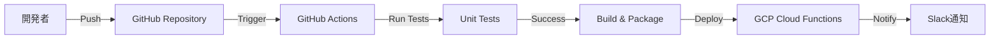

# インフラ構成図

## 1. 概要

本ドキュメントでは、受け継ぐAIのインフラ構成を定義する。

### 1.1 クラウドプロバイダ
- **採用**: Google Cloud Platform (GCP)
- **リージョン**: asia-northeast1（東京）
- **プロジェクト**: uketsuguai-prod（本番環境）、uketsuguai-dev（開発環境）

### 1.2 設計方針
- サーバーレスアーキテクチャによるスケーラビリティと運用負荷の低減
- マネージドサービスの積極活用
- セキュリティファーストの設計
- コスト最適化（無料枠の最大活用）

---

## 2. 全体構成図

```mermaid
graph TB
    subgraph "ユーザー"
        User[LINEユーザー]
    end

    subgraph "LINE Platform"
        LINE[LINE Messaging API<br/>公式アカウント]
    end

    subgraph "GCP - asia-northeast1"
        subgraph "Compute"
            CF1[Cloud Functions<br/>webhook-handler<br/>Python 3.11]
            CF2[Cloud Functions<br/>task-generator<br/>Python 3.11]
            CF3[Cloud Functions<br/>scraper-scheduler<br/>Python 3.11]
        end

        subgraph "Data Storage"
            CloudSQL[(Cloud SQL<br/>PostgreSQL 15<br/>db-f1-micro)]
            GCS[Cloud Storage<br/>documents-bucket]
        end

        subgraph "Secrets & Config"
            SecretMgr[Secret Manager<br/>API Keys, DB Credentials]
        end

        subgraph "Scheduling"
            Scheduler[Cloud Scheduler<br/>Weekly Scraping]
        end

        subgraph "Monitoring"
            Logging[Cloud Logging]
            Monitoring[Cloud Monitoring]
            ErrorReporting[Error Reporting]
        end

        subgraph "AI Services"
            VertexAI[Vertex AI<br/>Gemini 1.5 Flash API]
        end
    end

    subgraph "External Services"
        Pinecone[Pinecone<br/>Vector DB<br/>Free Tier]
        Stripe[Stripe<br/>Payment API]
        ChromeMCP[chrome-dev-mcp<br/>Web Scraping]
    end

    subgraph "Data Sources"
        eGov[e-gov<br/>法令データ]
        Municipality[自治体サイト]
        Financial[金融機関サイト]
    end

    User -->|メッセージ| LINE
    LINE -->|Webhook POST| CF1
    CF1 -->|Read/Write| CloudSQL
    CF1 -->|Get Secrets| SecretMgr
    CF1 -->|Call| VertexAI
    CF1 -->|Generate Tasks| CF2
    CF1 -->|Push Message| LINE

    CF2 -->|Query| Pinecone
    CF2 -->|Call| VertexAI
    CF2 -->|Read| GCS
    CF2 -->|Write Tasks| CloudSQL

    Scheduler -->|Trigger| CF3
    CF3 -->|Scrape| ChromeMCP
    ChromeMCP -->|Fetch| eGov
    ChromeMCP -->|Fetch| Municipality
    ChromeMCP -->|Fetch| Financial
    CF3 -->|Store| GCS
    CF3 -->|Embed| VertexAI
    CF3 -->|Update| Pinecone

    CF1 -->|Payment| Stripe

    CF1 -.->|Logs| Logging
    CF2 -.->|Logs| Logging
    CF3 -.->|Logs| Logging
    Logging -.->|Metrics| Monitoring
    Logging -.->|Errors| ErrorReporting

    style GCP fill:#4285f4,stroke:#333,stroke-width:2px,color:#fff
    style LINE fill:#00b900,stroke:#333,stroke-width:2px,color:#fff
```

---

## 3. コンポーネント詳細

### 3.1 Cloud Functions

#### 3.1.1 webhook-handler
- **役割**: LINE Webhookイベントの受信と処理
- **ランタイム**: Python 3.11
- **メモリ**: 256MB
- **タイムアウト**: 60秒
- **トリガー**: HTTPS (POST)
- **環境変数**:
  - `LINE_CHANNEL_SECRET`（Secret Manager参照）
  - `LINE_CHANNEL_ACCESS_TOKEN`（Secret Manager参照）
  - `DB_CONNECTION_NAME`
  - `GEMINI_API_KEY`（Secret Manager参照）
- **エンドポイント**: `https://asia-northeast1-uketsuguai-prod.cloudfunctions.net/webhook-handler`

#### 3.1.2 task-generator
- **役割**: RAGベースのタスク生成
- **ランタイム**: Python 3.11
- **メモリ**: 512MB
- **タイムアウト**: 120秒
- **トリガー**: Cloud Functions呼び出し（内部）
- **環境変数**:
  - `PINECONE_API_KEY`（Secret Manager参照）
  - `GEMINI_API_KEY`（Secret Manager参照）
  - `BUCKET_NAME`

#### 3.1.3 scraper-scheduler
- **役割**: 定期的な情報収集とベクトル化
- **ランタイム**: Python 3.11
- **メモリ**: 1GB
- **タイムアウト**: 540秒（9分）
- **トリガー**: Cloud Scheduler（週次）
- **環境変数**:
  - `PINECONE_API_KEY`（Secret Manager参照）
  - `GEMINI_API_KEY`（Secret Manager参照）
  - `BUCKET_NAME`

---

### 3.2 Cloud SQL

#### 3.2.1 インスタンス構成
- **バージョン**: PostgreSQL 15
- **インスタンスタイプ**: db-f1-micro（開発）→ db-g1-small（本番）
- **vCPU**: 1（共有）
- **メモリ**: 0.6GB → 1.7GB
- **ストレージ**: 10GB（SSD、自動拡張有効）
- **バックアップ**: 自動バックアップ有効（毎日4:00 JST）
- **高可用性**: Phase 2以降で有効化検討
- **接続方法**: Cloud SQL Proxy / Private IP（検討中）

#### 3.2.2 データベース
- **データベース名**: uketsuguai
- **文字コード**: UTF-8
- **タイムゾーン**: Asia/Tokyo

#### 3.2.3 ユーザー
- **管理ユーザー**: postgres（初期設定のみ使用）
- **アプリケーションユーザー**: app_user（最小権限）

---

### 3.3 Cloud Storage

#### 3.3.1 Bucket構成

**documents-bucket**
- **用途**: スクレイピングした文書の保管
- **ストレージクラス**: Standard
- **ロケーション**: asia-northeast1
- **ディレクトリ構成**:
  ```
  documents-bucket/
  ├── laws/              # 法令データ
  ├── municipalities/    # 自治体情報
  │   ├── tokyo/
  │   ├── osaka/
  │   └── ...
  ├── financial/         # 金融機関情報
  └── tips/              # Tips・豆知識
  ```
- **アクセス制御**: IAMのみ（Uniform bucket-level access）
- **バージョニング**: 無効
- **ライフサイクル**: 180日経過後にNearlineに移行

**backups-bucket**（将来的に追加）
- **用途**: アプリケーションログ、エクスポートデータ等
- **ストレージクラス**: Nearline

---

### 3.4 Secret Manager

#### 3.4.1 管理シークレット
- `LINE_CHANNEL_SECRET`
- `LINE_CHANNEL_ACCESS_TOKEN`
- `DB_PASSWORD`
- `GEMINI_API_KEY`
- `PINECONE_API_KEY`
- `STRIPE_SECRET_KEY`
- `SLACK_WEBHOOK_URL`（アラート通知用）

#### 3.4.2 アクセス制御
- Cloud Functionsのサービスアカウントに `secretAccessor` ロールを付与
- バージョニング有効（ローテーション対応）

---

### 3.5 Cloud Scheduler

#### 3.5.1 ジョブ定義

**weekly-scraper**
- **頻度**: 毎週日曜 2:00 JST
- **タイムゾーン**: Asia/Tokyo
- **ターゲット**: Cloud Functions (scraper-scheduler)
- **リトライ**: 3回まで

---

### 3.6 監視・ログ

#### 3.6.1 Cloud Logging
- **ログ収集**: 全Cloud Functionsのログを自動収集
- **保持期間**: 30日（デフォルト）
- **ログシンク**: 長期保存が必要な場合はBigQueryへエクスポート検討

#### 3.6.2 Cloud Monitoring
- **アラート設定**:
  - Cloud Functions エラー率 > 5%
  - Cloud SQL CPU使用率 > 80%
  - Cloud SQL ディスク使用率 > 80%
  - Webhook応答時間 > 3秒
- **通知先**: メール / Slack

#### 3.6.3 Error Reporting
- Cloud Functionsのエラーを自動収集
- エラーのグルーピングと通知

---

### 3.7 外部サービス

#### 3.7.1 Pinecone（ベクトルDB）
- **プラン**: Free Tier
- **インデックス**: 1つ
- **ストレージ**: 5GB
- **次元数**: 768（Gemini Embedding）
- **メトリック**: cosine

#### 3.7.2 Stripe（決済）
- **プラン**: 従量課金
- **用途**: サブスクリプション管理
- **Webhook**: Cloud Functionsで受信

#### 3.7.3 chrome-dev-mcp（スクレイピング）
- **実行環境**: Cloud Functions（scraper-scheduler内）
- **対象サイト**: e-gov、自治体、金融機関

---

## 4. ネットワーク構成

### 4.1 VPC（Virtual Private Cloud）

**Phase 1（MVP）**: デフォルトVPC使用

**Phase 2以降（検討）**:
- カスタムVPC作成
- サブネット分割（asia-northeast1-a, asia-northeast1-b）
- Cloud SQL Private IP接続
- Cloud NAT設定（外部通信用）

### 4.2 ファイアウォール

- Cloud Functionsは外部からHTTPSアクセス可能（LINE Webhookのため）
- Cloud SQLはVPC内部からのみアクセス可能
- Secret Managerは内部APIアクセスのみ

### 4.3 SSL/TLS

- Cloud FunctionsはデフォルトでHTTPS対応
- カスタムドメイン使用時はCloud Load Balancer + SSL証明書（Let's Encrypt）

---

## 5. セキュリティ

### 5.1 IAM（Identity and Access Management）

#### 5.1.1 サービスアカウント

**webhook-handler-sa**
- ロール:
  - `cloudsql.client`
  - `secretmanager.secretAccessor`
  - `aiplatform.user`（Vertex AI）
  - `storage.objectViewer`（Cloud Storage）

**task-generator-sa**
- ロール:
  - `secretmanager.secretAccessor`
  - `aiplatform.user`
  - `storage.objectViewer`

**scraper-scheduler-sa**
- ロール:
  - `secretmanager.secretAccessor`
  - `aiplatform.user`
  - `storage.objectCreator`

### 5.2 データ暗号化

- **通信**: HTTPS/TLS（すべての通信）
- **保存データ**:
  - Cloud SQL: デフォルト暗号化（CMEK検討）
  - Cloud Storage: デフォルト暗号化
  - Secret Manager: デフォルト暗号化

### 5.3 認証・認可

- LINE Webhookの署名検証（必須）
- Cloud FunctionsのIAM認証
- Secret Managerのアクセス制御

---

## 6. 可用性・信頼性

### 6.1 SLO（Service Level Objective）

- **稼働率**: 99%以上
- **Webhook応答時間**: 3秒以内（95パーセンタイル）
- **タスク生成時間**: 10秒以内

### 6.2 障害対策

#### Cloud Functions
- 自動スケーリングと冗長化（GCPデフォルト）
- リトライ処理の実装（べき等性確保）

#### Cloud SQL
- 自動バックアップ（毎日）
- ポイントインタイムリカバリ（PITR）対応
- Phase 2で高可用性構成（マルチゾーン）

#### Cloud Storage
- 地域冗長（デフォルト）
- バージョニング有効化（誤削除対策）

### 6.3 監視とアラート

- Cloud Monitoring によるリアルタイム監視
- エラー率、レイテンシ、リソース使用率のアラート
- Uptime Checks（外形監視）

---

## 7. デプロイ・CI/CD

### 7.1 デプロイフロー



### 7.2 GitHub Actions ワークフロー

**.github/workflows/deploy.yml**
- トリガー: main ブランチへのpush
- ステップ:
  1. Lint & Format check
  2. Unit tests
  3. Build
  4. Deploy to GCP（gcloud CLI使用）
  5. Smoke test（デプロイ後確認）
  6. Slack通知

### 7.3 環境管理

- **開発環境**: uketsuguai-dev
- **本番環境**: uketsuguai-prod
- 環境変数は Secret Manager で管理
- インフラコード: Terraform（Phase 2以降）

---

## 8. コスト見積もり

### 8.1 月額コスト（10ユーザー想定）

| サービス | 想定使用量 | 月額（円） |
|---------|-----------|----------|
| Cloud Functions | 10万リクエスト | 無料枠内 |
| Cloud SQL (db-f1-micro) | 常時稼働 | ¥1,500 |
| Cloud Storage | 5GB | ¥15 |
| Secret Manager | 10シークレット | ¥1 |
| Cloud Scheduler | 1ジョブ | 無料枠内 |
| Cloud Logging/Monitoring | 標準使用 | 無料枠内 |
| Vertex AI (Gemini Flash) | 100万トークン | 無料枠内 |
| **GCP 合計** | - | **¥1,516** |
| Pinecone (Free) | 5GB | ¥0 |
| Stripe（決済手数料） | 10人 × 500円 | ¥175（3.5%） |
| **総計** | - | **¥1,691** |

### 8.2 100ユーザー想定

| サービス | 想定使用量 | 月額（円） |
|---------|-----------|----------|
| Cloud Functions | 100万リクエスト | ¥100 |
| Cloud SQL (db-g1-small) | 常時稼働 | ¥4,500 |
| Cloud Storage | 20GB | ¥60 |
| Vertex AI (Gemini Flash) | 1000万トークン | ¥500 |
| **GCP 合計** | - | **¥5,160** |
| Stripe（決済手数料） | 100人 × 500円 | ¥1,750 |
| **総計** | - | **¥6,910** |

**収益**: 100人 × ¥500 = ¥50,000
**利益**: ¥50,000 - ¥6,910 = **¥43,090**

### 8.3 コスト最適化施策

- Gemini Flash の無料枠を最大活用
- Cloud Functions のコールドスタート対策（Minimum instances = 0）
- Cloud Storage のライフサイクル管理
- Cloud SQL のインスタンスサイズを需要に応じて調整
- 不要なログの削除（保持期間管理）

---

## 9. スケーリング計画

### 9.1 Phase 1（MVP: 〜10ユーザー）
- Cloud Functions: デフォルト設定
- Cloud SQL: db-f1-micro
- 手動監視

### 9.2 Phase 2（〜100ユーザー）
- Cloud Functions: Max instances = 10
- Cloud SQL: db-g1-small
- 自動アラート設定

### 9.3 Phase 3（100〜1000ユーザー）
- Cloud Functions: Max instances = 50
- Cloud SQL: db-n1-standard-1（高可用性構成）
- Read Replica 追加検討
- CDN導入（Cloud CDN）
- キャッシュ層追加（Cloud Memorystore / Redis）

---

## 10. ディザスタリカバリ

### 10.1 バックアップ戦略

**Cloud SQL**
- 自動バックアップ: 毎日 4:00 JST
- 保持期間: 30日
- ポイントインタイムリカバリ: 有効

**Cloud Storage**
- バージョニング: 有効
- オブジェクトライフサイクル: 削除後30日間保持

**Secret Manager**
- バージョニング: 有効（自動）

### 10.2 復旧手順

**データベース障害**
1. Cloud SQLのバックアップから復元
2. アプリケーション再起動
3. 動作確認

**Cloud Functions障害**
- 自動復旧（GCP冗長化）
- 必要に応じて再デプロイ

**リージョン障害**
- Phase 3でマルチリージョン対応検討

### 10.3 RTO/RPO

- **RTO（Recovery Time Objective）**: 1時間以内
- **RPO（Recovery Point Objective）**: 24時間以内（最悪ケース）

---

## 11. 開発環境

### 11.1 ローカル開発環境

**必要なツール**:
- Python 3.11
- Google Cloud SDK
- Docker（Cloud SQL Proxyテスト用）
- Git

**環境構築**:
```bash
# gcloud CLI インストール
curl https://sdk.cloud.google.com | bash

# プロジェクト設定
gcloud auth login
gcloud config set project uketsuguai-dev

# Cloud SQL Proxy起動
cloud_sql_proxy -instances=INSTANCE_CONNECTION_NAME=tcp:5432
```

### 11.2 開発フロー

1. ローカルで開発・テスト
2. GitHub にpush
3. GitHub Actions で自動テスト
4. main ブランチマージで自動デプロイ

---

## 付録

### 改訂履歴
| バージョン | 日付 | 変更内容 | 変更者 |
|---------|------|---------|--------|
| 1.0 | 2025-10-05 | 初版作成 | - |
| 1.1 | 2025-10-05 | 通知先をメール/Slackに確定 | - |

---
作成日: 2025-10-05
最終更新: 2025-10-05
