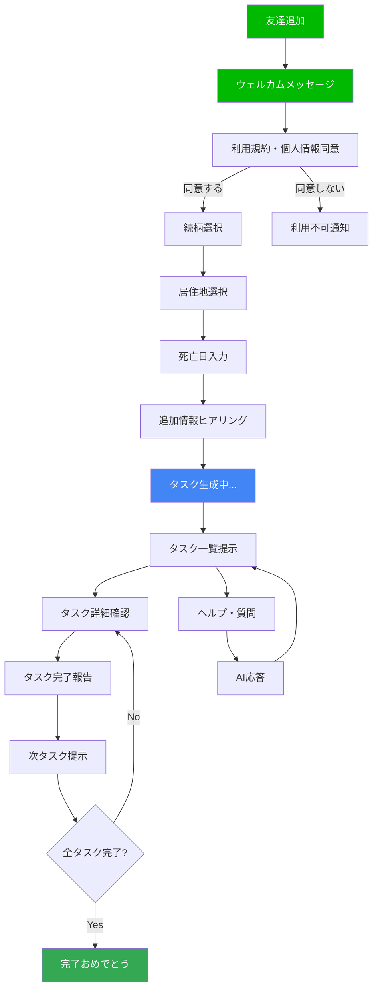

# LINE会話フロー設計書

## 1. 概要

本ドキュメントでは、受け継ぐAIのLINE公式アカウントにおける会話フローを定義する。

### 1.1 設計方針
- **選択式UI優先**: 個人情報の誤入力を防ぐため、クイックリプライやFlex Messageを積極活用
- **分かりやすい言葉**: 専門用語を避け、平易な表現を使用
- **段階的なヒアリング**: 一度に多くの情報を求めず、対話形式で進める
- **安心感の提供**: 常に次のステップを明示し、ユーザーを不安にさせない

---

## 2. 会話フロー全体図



---

## 3. 詳細フロー

### 3.1 友達追加〜ウェルカムメッセージ

#### 3.1.1 トリガー
- LINE公式アカウントを友達追加
- Webhook イベント: `follow`

#### 3.1.2 ウェルカムメッセージ

```
こんにちは。受け継ぐAIです。

大切な人を亡くされた方の手続きをサポートします。

このサービスでは、あなたの状況に合わせて：
✓ 必要な手続きをリストアップ
✓ 優先順位と期限をお知らせ
✓ 進捗を管理

をお手伝いします。

⚠️ 重要なお知らせ
以下の個人情報は入力しないでください：
・氏名、住所、電話番号
・口座番号、マイナンバー
・その他の機密情報

安全にご利用いただくため、選択式でお答えいただきます。

【利用規約】
https://uketsuguai.example.com/terms

【プライバシーポリシー】
https://uketsuguai.example.com/privacy

上記に同意いただける場合は「同意する」を選択してください。
```

**クイックリプライ**:
- `同意する`
- `同意しない`

---

### 3.2 ヒアリングフロー

#### 3.2.1 続柄の選択

**メッセージ**:
```
ありがとうございます。
まず、亡くなられた方との続柄を教えてください。
```

**クイックリプライ**:
- `父`
- `母`
- `配偶者`
- `祖父母`
- `兄弟姉妹`
- `その他`

**バリデーション**: なし（選択式のため）

**DB保存**: `user_profiles.relationship`

---

#### 3.2.2 居住地の選択（2段階）

**ステップ1: 都道府県選択**

```
お住まいの都道府県を選択してください。

※手続きに必要な自治体情報を提供するためにお伺いします。
```

**Flex Message**: 都道府県一覧（スクロール可能）
- 47都道府県をボタン形式で表示
- 例: `東京都`, `神奈川県`, `大阪府`, ...

**ステップ2: 市町村選択**

```
[選択された都道府県]の市町村を選択してください。
```

**Flex Message**: 市町村一覧（選択された都道府県の市町村）
- 例: 東京都の場合 → `千代田区`, `中央区`, `港区`, ...

**DB保存**:
- `user_profiles.prefecture`
- `user_profiles.municipality`

---

#### 3.2.3 死亡日の入力

```
亡くなられた日を教えてください。

以下の形式で入力してください：
2024-01-15
（年-月-日）
```

**入力形式**: テキスト入力（日付形式）

**バリデーション**:
- 日付形式チェック（YYYY-MM-DD）
- 未来日でないこと
- 過去3年以内を推奨（古すぎる場合は警告）

**エラー時**:
```
⚠️ 日付の形式が正しくありません。
以下の形式で再度入力してください：
2024-01-15
（年-月-日）
```

**DB保存**: `user_profiles.death_date`

---

#### 3.2.4 追加情報のヒアリング

```
ありがとうございます。
最後に、より正確なタスクをご提案するため、いくつか質問させてください。

該当するものをすべて選択してください。
```

**チェックボックス（複数選択）**:
- `不動産を所有していた`
- `金融資産（預金・株式等）がある`
- `年金を受給していた`
- `生命保険に加入していた`
- `事業を経営していた`
- `該当なし`

**DB保存**: `user_profiles.additional_info` (JSONB)
```json
{
  "has_real_estate": true,
  "has_financial_assets": true,
  "has_pension": true,
  "has_life_insurance": false,
  "has_business": false
}
```

---

### 3.3 タスク生成

#### 3.3.1 処理中メッセージ

```
情報をありがとうございました。

あなたの状況に合わせたタスクを生成しています...
少々お待ちください。
（10〜20秒ほどかかります）
```

**ローディングアニメーション**: LINE送信中の「...」表示を活用

#### 3.3.2 バックエンド処理
1. ヒアリング情報を取得
2. RAGで関連知識を検索
3. Gemini APIでタスク生成
4. タスクをDBに保存
5. 優先順位・期限を設定

---

### 3.4 タスク一覧の提示

#### 3.4.1 タスク一覧メッセージ

```
お待たせしました。
あなたに必要な手続きは全部で15件です。

優先度が高いものから順に表示します。
各タスクの詳細は、タスク名をタップしてください。

【進捗】0/15件完了
```

#### 3.4.2 Flex Message（カルーセル形式）

**タスクカード例（高優先度）**:
```
┌─────────────────────┐
│ 🔴 優先度：高          │
│ 📋 死亡届の提出        │
│                       │
│ 期限：死亡から7日以内   │
│ 締切：2024-01-22      │
│                       │
│ [詳細を見る] [完了報告] │
└─────────────────────┘
```

**カード項目**:
- 優先度アイコン（🔴高 / 🟡中 / 🟢低）
- タスク名
- 期限情報
- アクションボタン

**アクションボタン**:
- `詳細を見る`: タスク詳細を表示
- `完了報告`: タスク完了を報告

---

### 3.5 タスク詳細の表示

#### 3.5.1 タスク詳細メッセージ

```
📋 死亡届の提出

【概要】
死亡届は、死亡の事実を知った日から7日以内に市町村役場に提出する必要があります。

【必要書類】
・死亡診断書（医師が作成）
・届出人の印鑑
・届出人の本人確認書類

【提出先】
千代田区役所 戸籍住民課
住所：東京都千代田区九段南1-2-1
電話：03-XXXX-XXXX

【参考リンク】
https://www.city.chiyoda.lg.jp/...

【補足情報】
・葬儀社が代行することも可能です
・24時間受付可能な夜間窓口があります

完了したら「完了報告」ボタンを押してください。
```

**アクションボタン**:
- `完了報告`
- `メモを追加`
- `一覧に戻る`

---

### 3.6 タスク完了報告

#### 3.6.1 完了確認

```
「死亡届の提出」を完了しましたか？
```

**クイックリプライ**:
- `完了しました`
- `スキップ`
- `キャンセル`

#### 3.6.2 完了時の応答

```
お疲れさまでした！
「死亡届の提出」を完了としました。

【進捗】1/15件完了

次のタスクは「年金受給停止の手続き」です。
```

**次タスクのカード表示**（Flex Message）

#### 3.6.3 スキップ時の応答

```
「死亡届の提出」をスキップしました。

後で戻ることもできます。
一覧から確認してください。
```

---

### 3.7 リマインダー

#### 3.7.1 期限前リマインダー（3日前）

```
⏰ リマインダー

「死亡届の提出」の期限が近づいています。

期限：2024-01-22（あと3日）

まだ完了していない場合は、お早めにお手続きください。

[詳細を見る] [完了報告]
```

#### 3.7.2 期限当日リマインダー

```
🚨 期限当日です

「死亡届の提出」の期限は本日です。

期限：2024-01-22（本日）

お忘れなくお手続きください。

[詳細を見る] [完了報告]
```

#### 3.7.3 期限超過通知

```
⚠️ 期限を過ぎています

「死亡届の提出」の期限を過ぎています。

期限：2024-01-22（3日前）

できるだけ早くお手続きください。
不明点があればお気軽にお尋ねください。

[詳細を見る] [質問する]
```

---

### 3.8 AI質問応答

#### 3.8.1 質問の受付

**トリガー**:
- リッチメニュー「質問する」
- フリーテキスト入力

**個人情報検知**:
- 電話番号、住所等が含まれている場合は警告

```
⚠️ 電話番号と思われる情報が含まれています。
個人情報は入力しないでください。

もう一度お試しください。
```

#### 3.8.2 AI応答

**ユーザー入力例**:
```
死亡届は郵送でも提出できますか？
```

**AI応答**:
```
死亡届は、原則として窓口での提出が必要です。

ただし、以下の場合は郵送も可能です：
・遠方に住んでいる場合
・やむを得ない事情がある場合

郵送の場合は、以下の書類を同封してください：
・死亡届
・死亡診断書のコピー
・返信用封筒

詳しくは、千代田区役所にお問い合わせください。
電話：03-XXXX-XXXX

他にご質問はありますか？
```

**情報ソース**: RAG（関連文書を検索 → Gemini APIで回答生成）

---

### 3.9 全タスク完了

#### 3.9.1 完了メッセージ

```
🎉 おめでとうございます！

すべてのタスクが完了しました。

【進捗】15/15件完了

大変な時期に、本当にお疲れさまでした。

今後も何かお困りのことがあれば、
いつでもお声がけください。

受け継ぐAIは、あなたをサポートします。

【アンケートのお願い】
サービス改善のため、ご意見をお聞かせください。
[アンケートに回答する]
```

#### 3.9.2 継続利用の案内

```
【今後のご利用について】

サブスクリプションは引き続き有効です。

以下の機能もご利用いただけます：
・過去のタスク履歴の確認
・追加の手続き相談
・専門家への相談（準備中）

[マイページを見る]
```

---

## 4. リッチメニュー

### 4.1 メニュー構成

```
┌──────────┬──────────┐
│  📋       │  ❓      │
│タスク一覧 │  質問する │
│          │          │
├──────────┼──────────┤
│  📊      │  ⚙️      │
│ 進捗確認  │ 設定     │
│          │          │
└──────────┴──────────┘
```

### 4.2 各メニューの動作

**タスク一覧**:
- タスク一覧（Flex Message）を表示

**質問する**:
- AIに質問できるフリーテキスト入力を促す

**進捗確認**:
- 完了/未完了の進捗グラフを表示
- カテゴリ別の進捗も確認可能

**設定**:
- 通知設定（リマインダーON/OFF）
- プロフィール変更
- サブスクリプション管理
- ヘルプ・お問い合わせ

---

## 5. エラーハンドリング

### 5.1 想定エラーと対処

#### 5.1.1 タスク生成失敗

```
申し訳ございません。
タスクの生成に失敗しました。

時間をおいて再度お試しください。
それでも解決しない場合は、お問い合わせください。

[再試行] [お問い合わせ]
```

#### 5.1.2 AI応答エラー

```
申し訳ございません。
回答の生成に失敗しました。

もう一度お試しいただくか、
別の表現でご質問ください。

[再試行]
```

#### 5.1.3 ネットワークエラー

```
通信エラーが発生しました。

インターネット接続をご確認の上、
もう一度お試しください。

[再試行]
```

---

## 6. 通知・プッシュメッセージ

### 6.1 プッシュ通知のタイミング

1. **タスク生成完了時**
   ```
   タスクの生成が完了しました！
   全15件のタスクをご確認ください。
   ```

2. **期限3日前**（リマインダー）
   - 3.7.1 参照

3. **期限当日**（リマインダー）
   - 3.7.2 参照

4. **期限超過**（警告）
   - 3.7.3 参照

5. **新機能リリース**
   ```
   【お知らせ】
   新機能「専門家相談」をリリースしました！

   詳細はこちら
   [詳しく見る]
   ```

6. **サブスクリプション期限**
   ```
   【重要】サブスクリプション更新のお知らせ

   あと3日で更新日です。
   引き続きご利用いただく場合は、
   お手続きをお願いいたします。

   [更新手続きへ]
   ```

### 6.2 通知頻度の制限

- 1日最大3件まで
- 深夜（22:00〜8:00）は通知しない
- ユーザー設定で通知OFF可能

---

## 7. Flex Message テンプレート

### 7.1 タスクカード（詳細版）

```json
{
  "type": "bubble",
  "hero": {
    "type": "box",
    "layout": "vertical",
    "contents": [
      {
        "type": "text",
        "text": "🔴 優先度：高",
        "color": "#ff0000",
        "size": "sm",
        "weight": "bold"
      }
    ],
    "backgroundColor": "#fff5f5"
  },
  "body": {
    "type": "box",
    "layout": "vertical",
    "contents": [
      {
        "type": "text",
        "text": "死亡届の提出",
        "size": "xl",
        "weight": "bold"
      },
      {
        "type": "text",
        "text": "期限：死亡から7日以内",
        "size": "sm",
        "color": "#666666",
        "margin": "md"
      },
      {
        "type": "text",
        "text": "締切：2024-01-22",
        "size": "sm",
        "color": "#ff0000",
        "weight": "bold"
      }
    ]
  },
  "footer": {
    "type": "box",
    "layout": "vertical",
    "contents": [
      {
        "type": "button",
        "action": {
          "type": "postback",
          "label": "詳細を見る",
          "data": "action=view_task&task_id=123"
        },
        "style": "primary"
      },
      {
        "type": "button",
        "action": {
          "type": "postback",
          "label": "完了報告",
          "data": "action=complete_task&task_id=123"
        },
        "style": "secondary"
      }
    ]
  }
}
```

### 7.2 進捗カード

```json
{
  "type": "bubble",
  "body": {
    "type": "box",
    "layout": "vertical",
    "contents": [
      {
        "type": "text",
        "text": "あなたの進捗",
        "size": "xl",
        "weight": "bold"
      },
      {
        "type": "box",
        "layout": "vertical",
        "contents": [
          {
            "type": "text",
            "text": "5/15件完了",
            "size": "xxl",
            "weight": "bold",
            "color": "#4285f4"
          },
          {
            "type": "text",
            "text": "33%",
            "size": "sm",
            "color": "#666666"
          }
        ],
        "margin": "lg"
      },
      {
        "type": "box",
        "layout": "vertical",
        "contents": [
          {
            "type": "box",
            "layout": "horizontal",
            "contents": [
              {
                "type": "filler"
              }
            ],
            "backgroundColor": "#e0e0e0",
            "height": "12px",
            "cornerRadius": "6px"
          }
        ],
        "margin": "md"
      }
    ]
  }
}
```

---

## 8. 会話例

### 8.1 初回ヒアリング〜タスク提示（全フロー）

```
[ユーザー] 友達追加

[Bot] こんにちは。受け継ぐAIです。
（ウェルカムメッセージ全文）
[同意する] [同意しない]

[ユーザー] 同意する

[Bot] ありがとうございます。
まず、亡くなられた方との続柄を教えてください。
[父] [母] [配偶者] [祖父母] [兄弟姉妹] [その他]

[ユーザー] 父

[Bot] お住まいの都道府県を選択してください。
（Flex Message: 都道府県一覧）

[ユーザー] 東京都

[Bot] 東京都の市町村を選択してください。
（Flex Message: 市町村一覧）

[ユーザー] 千代田区

[Bot] 亡くなられた日を教えてください。
以下の形式で入力してください：
2024-01-15（年-月-日）

[ユーザー] 2024-01-15

[Bot] ありがとうございます。
最後に、より正確なタスクをご提案するため、いくつか質問させてください。
（チェックボックス表示）

[ユーザー] [不動産を所有していた] [年金を受給していた] を選択

[Bot] 情報をありがとうございました。
あなたの状況に合わせたタスクを生成しています...
（10秒待機）

[Bot] お待たせしました。
あなたに必要な手続きは全部で15件です。
（タスク一覧 Flex Message表示）
```

### 8.2 タスク詳細〜完了報告

```
[ユーザー] 「死亡届の提出」の [詳細を見る] をタップ

[Bot] 📋 死亡届の提出
（タスク詳細全文）
[完了報告] [メモを追加] [一覧に戻る]

[ユーザー] 完了報告

[Bot] 「死亡届の提出」を完了しましたか？
[完了しました] [スキップ] [キャンセル]

[ユーザー] 完了しました

[Bot] お疲れさまでした！
「死亡届の提出」を完了としました。
【進捗】1/15件完了
次のタスクは「年金受給停止の手続き」です。
（次タスクカード表示）
```

### 8.3 AI質問応答

```
[ユーザー] 死亡届は郵送でも提出できますか？

[Bot] （個人情報検知: なし）
死亡届は、原則として窓口での提出が必要です。
（AI応答全文）

[ユーザー] 03-1234-5678に電話すればいいですか？

[Bot] ⚠️ 電話番号と思われる情報が含まれています。
個人情報は入力しないでください。
もう一度お試しください。
```

---

## 付録

### 改訂履歴
| バージョン | 日付 | 変更内容 | 変更者 |
|---------|------|---------|--------|
| 1.0 | 2025-10-05 | 初版作成 | - |

---
作成日: 2025-10-05
最終更新: 2025-10-05
