# API設計書

## 1. 概要

本ドキュメントでは、受け継ぐAIのAPI仕様を定義する。

### 1.1 API種別
- **外部API**: LINE Messaging API、Stripe Webhook等からのリクエストを受け付ける
- **内部API**: Cloud Functions間の通信

### 1.2 基本仕様
- **プロトコル**: HTTPS
- **データ形式**: JSON
- **文字コード**: UTF-8
- **認証**: LINE署名検証、Stripe署名検証
- **エラーレスポンス**: 統一フォーマット

---

## 2. エンドポイント一覧

### 2.1 外部API

| メソッド | エンドポイント | 説明 | 認証 |
|---------|---------------|------|------|
| POST | /webhook | LINE Webhook受信 | LINE署名 |
| POST | /stripe/webhook | Stripe Webhook受信 | Stripe署名 |

### 2.2 内部API（Cloud Functions間）

| メソッド | エンドポイント | 説明 | 認証 |
|---------|---------------|------|------|
| POST | /internal/tasks/generate | タスク生成 | IAM |
| POST | /internal/ai/chat | AI応答生成 | IAM |
| POST | /internal/scrape | スクレイピング実行 | IAM |

---

## 3. API詳細仕様

### 3.1 LINE Webhook

#### 3.1.1 基本情報

- **エンドポイント**: `POST /webhook`
- **URL**: `https://asia-northeast1-uketsuguai-prod.cloudfunctions.net/webhook-handler`
- **認証**: LINE署名検証（X-Line-Signature header）
- **タイムアウト**: 3秒以内に応答（LINE要件）

#### 3.1.2 リクエスト

**Headers**:
```
Content-Type: application/json
X-Line-Signature: <署名>
```

**Body**（例: followイベント）:
```json
{
  "destination": "xxxxxxxxxx",
  "events": [
    {
      "type": "follow",
      "timestamp": 1705299600000,
      "source": {
        "type": "user",
        "userId": "U1234567890abcdef"
      },
      "replyToken": "nHuyWiB7yP5Zw52FIkcQobQuGDXCTA"
    }
  ]
}
```

**Body**（例: messageイベント）:
```json
{
  "destination": "xxxxxxxxxx",
  "events": [
    {
      "type": "message",
      "timestamp": 1705299600000,
      "source": {
        "type": "user",
        "userId": "U1234567890abcdef"
      },
      "replyToken": "nHuyWiB7yP5Zw52FIkcQobQuGDXCTA",
      "message": {
        "id": "12345678",
        "type": "text",
        "text": "こんにちは"
      }
    }
  ]
}
```

**Body**（例: postbackイベント）:
```json
{
  "destination": "xxxxxxxxxx",
  "events": [
    {
      "type": "postback",
      "timestamp": 1705299600000,
      "source": {
        "type": "user",
        "userId": "U1234567890abcdef"
      },
      "replyToken": "nHuyWiB7yP5Zw52FIkcQobQuGDXCTA",
      "postback": {
        "data": "action=complete_task&task_id=abc-123"
      }
    }
  ]
}
```

#### 3.1.3 レスポンス

**成功時（200 OK）**:
```json
{
  "status": "ok"
}
```

**エラー時（400 Bad Request）**:
```json
{
  "error": {
    "code": "INVALID_SIGNATURE",
    "message": "Invalid signature"
  }
}
```

#### 3.1.4 処理フロー

```mermaid
sequenceDiagram
    participant LINE
    participant Webhook as webhook-handler
    participant DB as Cloud SQL
    participant TaskGen as task-generator
    participant AI as Gemini API

    LINE->>Webhook: POST /webhook (follow event)
    Webhook->>Webhook: 署名検証
    Webhook->>DB: ユーザー登録
    Webhook->>LINE: Reply (ウェルカムメッセージ)
    Webhook-->>LINE: 200 OK

    LINE->>Webhook: POST /webhook (message: "同意する")
    Webhook->>Webhook: 署名検証
    Webhook->>DB: ユーザー状態更新
    Webhook->>LINE: Reply (続柄選択)
    Webhook-->>LINE: 200 OK

    LINE->>Webhook: POST /webhook (postback: relationship=father)
    Webhook->>Webhook: 署名検証
    Webhook->>DB: プロフィール保存
    Webhook->>LINE: Reply (居住地選択)
    Webhook-->>LINE: 200 OK

    Note over Webhook,TaskGen: ヒアリング完了後
    LINE->>Webhook: POST /webhook (最終入力完了)
    Webhook->>TaskGen: タスク生成リクエスト
    TaskGen->>AI: タスク生成（RAG + Gemini）
    AI-->>TaskGen: 生成結果
    TaskGen->>DB: タスク保存
    TaskGen-->>Webhook: 生成完了
    Webhook->>LINE: Push (タスク一覧)
    Webhook-->>LINE: 200 OK
```



---

### 3.2 タスク生成API（内部）

#### 3.2.1 基本情報

- **エンドポイント**: `POST /internal/tasks/generate`
- **呼び出し元**: webhook-handler
- **認証**: Cloud Functions IAM認証
- **タイムアウト**: 120秒

#### 3.2.2 リクエスト

**Headers**:
```
Content-Type: application/json
Authorization: Bearer <Cloud Functions ID Token>
```

**Body**:
```json
{
  "user_id": "550e8400-e29b-41d4-a716-446655440000",
  "profile": {
    "relationship": "father",
    "prefecture": "東京都",
    "municipality": "千代田区",
    "death_date": "2024-01-15",
    "additional_info": {
      "has_real_estate": true,
      "has_financial_assets": true,
      "has_pension": true,
      "has_life_insurance": false,
      "has_business": false
    }
  }
}
```

#### 3.2.3 レスポンス

**成功時（200 OK）**:
```json
{
  "status": "success",
  "data": {
    "task_count": 15,
    "tasks": [
      {
        "id": "abc-123",
        "title": "死亡届の提出",
        "description": "死亡届は、死亡の事実を知った日から7日以内に...",
        "category": "death_certificate",
        "priority": "high",
        "due_date": "2024-01-22",
        "order_index": 1,
        "metadata": {
          "related_links": [
            {
              "title": "千代田区役所",
              "url": "https://..."
            }
          ],
          "required_documents": ["死亡診断書", "届出人の印鑑"],
          "estimated_duration": "30分"
        }
      },
      {
        "id": "def-456",
        "title": "年金受給停止の手続き",
        "description": "年金受給を停止するため、年金事務所に...",
        "category": "pension",
        "priority": "high",
        "due_date": "2024-02-04",
        "order_index": 2,
        "metadata": {
          "related_links": [],
          "required_documents": ["年金証書", "死亡診断書のコピー"],
          "estimated_duration": "1時間"
        }
      }
    ]
  }
}
```

**エラー時（500 Internal Server Error）**:
```json
{
  "error": {
    "code": "TASK_GENERATION_FAILED",
    "message": "Failed to generate tasks",
    "details": "Gemini API error: Rate limit exceeded"
  }
}
```

#### 3.2.4 処理フロー

1. プロフィール情報を受け取る
2. RAGでベクトル検索（関連法令・自治体情報）
3. Gemini APIでタスクリスト生成
4. 生成されたタスクをCloud SQLに保存
5. タスクIDと件数を返す

---

### 3.3 AI応答生成API（内部）

#### 3.3.1 基本情報

- **エンドポイント**: `POST /internal/ai/chat`
- **呼び出し元**: webhook-handler
- **認証**: Cloud Functions IAM認証
- **タイムアウト**: 30秒

#### 3.3.2 リクエスト

**Headers**:
```
Content-Type: application/json
Authorization: Bearer <Cloud Functions ID Token>
```

**Body**:
```json
{
  "user_id": "550e8400-e29b-41d4-a716-446655440000",
  "message": "死亡届は郵送でも提出できますか？",
  "conversation_history": [
    {
      "role": "user",
      "content": "こんにちは"
    },
    {
      "role": "assistant",
      "content": "こんにちは。何かお困りですか？"
    }
  ]
}
```

#### 3.3.3 レスポンス

**成功時（200 OK）**:
```json
{
  "status": "success",
  "data": {
    "response": "死亡届は、原則として窓口での提出が必要です。\n\nただし、以下の場合は郵送も可能です：\n・遠方に住んでいる場合\n・やむを得ない事情がある場合\n\n郵送の場合は、以下の書類を同封してください：\n・死亡届\n・死亡診断書のコピー\n・返信用封筒\n\n詳しくは、千代田区役所にお問い合わせください。",
    "sources": [
      {
        "title": "千代田区 死亡届について",
        "url": "https://..."
      }
    ],
    "tokens_used": 350
  }
}
```

**エラー時（500 Internal Server Error）**:
```json
{
  "error": {
    "code": "AI_RESPONSE_FAILED",
    "message": "Failed to generate AI response"
  }
}
```

#### 3.3.4 処理フロー

1. ユーザーメッセージを受け取る
2. 個人情報検知バリデーション
3. RAGで関連情報を検索
4. Gemini APIで回答生成（会話履歴を含む）
5. 応答をDBに保存（conversation_history）
6. 応答を返す

---

### 3.4 Stripe Webhook

#### 3.4.1 基本情報

- **エンドポイント**: `POST /stripe/webhook`
- **URL**: `https://asia-northeast1-uketsuguai-prod.cloudfunctions.net/stripe-webhook`
- **認証**: Stripe署名検証（Stripe-Signature header）

#### 3.4.2 リクエスト

**Headers**:
```
Content-Type: application/json
Stripe-Signature: t=1234567890,v1=xxxxx,v0=xxxxx
```

**Body**（例: customer.subscription.created）:
```json
{
  "id": "evt_1234567890",
  "object": "event",
  "type": "customer.subscription.created",
  "data": {
    "object": {
      "id": "sub_1234567890",
      "customer": "cus_1234567890",
      "status": "active",
      "current_period_start": 1705299600,
      "current_period_end": 1707891600,
      "items": {
        "data": [
          {
            "plan": {
              "id": "price_beta_monthly",
              "amount": 500,
              "currency": "jpy"
            }
          }
        ]
      }
    }
  }
}
```

#### 3.4.3 レスポンス

**成功時（200 OK）**:
```json
{
  "status": "received"
}
```

#### 3.4.4 処理対象イベント

- `customer.subscription.created`: サブスクリプション作成
- `customer.subscription.updated`: サブスクリプション更新
- `customer.subscription.deleted`: サブスクリプション解約
- `invoice.payment_succeeded`: 支払い成功
- `invoice.payment_failed`: 支払い失敗

---

### 3.5 スクレイピング実行API（内部）

#### 3.5.1 基本情報

- **エンドポイント**: `POST /internal/scrape`
- **呼び出し元**: Cloud Scheduler
- **認証**: Cloud Functions IAM認証
- **タイムアウト**: 540秒（9分）

#### 3.5.2 リクエスト

**Headers**:
```
Content-Type: application/json
Authorization: Bearer <Cloud Functions ID Token>
```

**Body**:
```json
{
  "targets": [
    {
      "type": "municipality",
      "name": "東京都千代田区",
      "url": "https://www.city.chiyoda.lg.jp/..."
    },
    {
      "type": "law",
      "name": "e-gov 戸籍法",
      "url": "https://elaws.e-gov.go.jp/..."
    }
  ]
}
```

#### 3.5.3 レスポンス

**成功時（200 OK）**:
```json
{
  "status": "success",
  "data": {
    "scraped_count": 2,
    "updated_count": 1,
    "skipped_count": 1,
    "results": [
      {
        "target": "東京都千代田区",
        "status": "updated",
        "documents_saved": 5,
        "vectors_updated": 5
      },
      {
        "target": "e-gov 戸籍法",
        "status": "skipped",
        "reason": "No changes detected"
      }
    ]
  }
}
```

---

## 4. 共通仕様

### 4.1 エラーレスポンス

**フォーマット**:
```json
{
  "error": {
    "code": "ERROR_CODE",
    "message": "Human readable error message",
    "details": "Optional detailed information"
  }
}
```

**エラーコード一覧**:

| コード | HTTPステータス | 説明 |
|-------|--------------|------|
| INVALID_SIGNATURE | 400 | 署名検証失敗 |
| INVALID_REQUEST | 400 | リクエスト形式エラー |
| PERSONAL_INFO_DETECTED | 400 | 個人情報が検出された |
| UNAUTHORIZED | 401 | 認証エラー |
| FORBIDDEN | 403 | アクセス権限なし |
| NOT_FOUND | 404 | リソースが見つからない |
| RATE_LIMIT_EXCEEDED | 429 | レート制限超過 |
| INTERNAL_ERROR | 500 | サーバー内部エラー |
| TASK_GENERATION_FAILED | 500 | タスク生成失敗 |
| AI_RESPONSE_FAILED | 500 | AI応答生成失敗 |
| DATABASE_ERROR | 500 | データベースエラー |
| EXTERNAL_API_ERROR | 502 | 外部API呼び出しエラー |
| TIMEOUT | 504 | タイムアウト |

### 4.2 レート制限

**外部API**:
- LINE Webhook: 制限なし（LINE側の制限に従う）
- Stripe Webhook: 制限なし（Stripe側の制限に従う）

**内部API**:
- Cloud Functions間の呼び出しは制限なし
- Gemini API: 無料枠の範囲内で制限

### 4.3 ログ記録

**記録項目**:
- リクエストID（UUID）
- タイムスタンプ
- エンドポイント
- HTTPメソッド
- ステータスコード
- レスポンスタイム
- エラー詳細（エラー時）

**個人情報の扱い**:
- LINE User IDはハッシュ化してログに記録
- メッセージ内容は記録しない（デバッグ時のみ）

---

## 5. LINE Messaging API 利用仕様

### 5.1 Reply API

#### 5.1.1 基本情報

- **エンドポイント**: `POST https://api.line.me/v2/bot/message/reply`
- **認証**: Bearer token（LINE_CHANNEL_ACCESS_TOKEN）
- **制限**: 1つのreplyTokenにつき1回のみ

#### 5.1.2 リクエスト例

**Headers**:
```
Content-Type: application/json
Authorization: Bearer {channel_access_token}
```

**Body**（テキストメッセージ）:
```json
{
  "replyToken": "nHuyWiB7yP5Zw52FIkcQobQuGDXCTA",
  "messages": [
    {
      "type": "text",
      "text": "こんにちは。受け継ぐAIです。"
    }
  ]
}
```

**Body**（クイックリプライ）:
```json
{
  "replyToken": "nHuyWiB7yP5Zw52FIkcQobQuGDXCTA",
  "messages": [
    {
      "type": "text",
      "text": "亡くなられた方との続柄を教えてください。",
      "quickReply": {
        "items": [
          {
            "type": "action",
            "action": {
              "type": "postback",
              "label": "父",
              "data": "relationship=father"
            }
          },
          {
            "type": "action",
            "action": {
              "type": "postback",
              "label": "母",
              "data": "relationship=mother"
            }
          }
        ]
      }
    }
  ]
}
```

**Body**（Flex Message）:
```json
{
  "replyToken": "nHuyWiB7yP5Zw52FIkcQobQuGDXCTA",
  "messages": [
    {
      "type": "flex",
      "altText": "タスク一覧",
      "contents": {
        "type": "carousel",
        "contents": [
          {
            "type": "bubble",
            "hero": {
              "type": "box",
              "layout": "vertical",
              "contents": [
                {
                  "type": "text",
                  "text": "🔴 優先度：高",
                  "color": "#ff0000",
                  "size": "sm"
                }
              ]
            },
            "body": {
              "type": "box",
              "layout": "vertical",
              "contents": [
                {
                  "type": "text",
                  "text": "死亡届の提出",
                  "weight": "bold",
                  "size": "xl"
                }
              ]
            },
            "footer": {
              "type": "box",
              "layout": "vertical",
              "contents": [
                {
                  "type": "button",
                  "action": {
                    "type": "postback",
                    "label": "詳細を見る",
                    "data": "action=view_task&task_id=abc-123"
                  },
                  "style": "primary"
                }
              ]
            }
          }
        ]
      }
    }
  ]
}
```

---

### 5.2 Push API

#### 5.2.1 基本情報

- **エンドポイント**: `POST https://api.line.me/v2/bot/message/push`
- **認証**: Bearer token（LINE_CHANNEL_ACCESS_TOKEN）
- **制限**: フリープラン 200通/月、ライトプラン 5,000円で追加

#### 5.2.2 リクエスト例

**Headers**:
```
Content-Type: application/json
Authorization: Bearer {channel_access_token}
```

**Body**:
```json
{
  "to": "U1234567890abcdef",
  "messages": [
    {
      "type": "text",
      "text": "⏰ リマインダー\n\n「死亡届の提出」の期限が近づいています。\n\n期限：2024-01-22（あと3日）"
    }
  ]
}
```

---

## 6. Gemini API 利用仕様

### 6.1 Chat API

#### 6.1.1 基本情報

- **エンドポイント**: `POST https://generativelanguage.googleapis.com/v1/models/gemini-1.5-flash:generateContent`
- **認証**: API Key（GEMINI_API_KEY）
- **モデル**: gemini-1.5-flash

#### 6.1.2 リクエスト例

**Headers**:
```
Content-Type: application/json
x-goog-api-key: {api_key}
```

**Body**（タスク生成）:
```json
{
  "contents": [
    {
      "role": "user",
      "parts": [
        {
          "text": "以下のプロフィール情報を元に、死亡後の手続きタスクをJSON形式で生成してください。\n\n【プロフィール】\n- 続柄：父\n- 居住地：東京都千代田区\n- 死亡日：2024-01-15\n- 不動産：あり\n- 年金：あり\n\n【関連情報】\n{RAGで取得した法令・自治体情報}\n\n【出力フォーマット】\n```json\n[\n  {\n    \"title\": \"タスク名\",\n    \"description\": \"詳細説明\",\n    \"category\": \"カテゴリ\",\n    \"priority\": \"high/medium/low\",\n    \"due_date\": \"YYYY-MM-DD\"\n  }\n]\n```"
        }
      ]
    }
  ],
  "generationConfig": {
    "temperature": 0.3,
    "maxOutputTokens": 2048
  }
}
```

#### 6.1.3 レスポンス例

```json
{
  "candidates": [
    {
      "content": {
        "parts": [
          {
            "text": "```json\n[\n  {\n    \"title\": \"死亡届の提出\",\n    \"description\": \"死亡届は、死亡の事実を知った日から7日以内に市町村役場に提出する必要があります。\",\n    \"category\": \"death_certificate\",\n    \"priority\": \"high\",\n    \"due_date\": \"2024-01-22\"\n  },\n  {\n    \"title\": \"年金受給停止の手続き\",\n    \"description\": \"年金受給を停止するため、年金事務所に届け出が必要です。\",\n    \"category\": \"pension\",\n    \"priority\": \"high\",\n    \"due_date\": \"2024-02-04\"\n  }\n]\n```"
          }
        ],
        "role": "model"
      },
      "finishReason": "STOP"
    }
  ],
  "usageMetadata": {
    "promptTokenCount": 500,
    "candidatesTokenCount": 350,
    "totalTokenCount": 850
  }
}
```

---

### 6.2 Embedding API

#### 6.2.1 基本情報

- **エンドポイント**: `POST https://generativelanguage.googleapis.com/v1/models/text-embedding-004:embedContent`
- **認証**: API Key（GEMINI_API_KEY）
- **次元数**: 768

#### 6.2.2 リクエスト例

**Headers**:
```
Content-Type: application/json
x-goog-api-key: {api_key}
```

**Body**:
```json
{
  "model": "models/text-embedding-004",
  "content": {
    "parts": [
      {
        "text": "死亡届は、死亡の事実を知った日から7日以内に市町村役場に提出する必要があります。"
      }
    ]
  }
}
```

#### 6.2.3 レスポンス例

```json
{
  "embedding": {
    "values": [0.013168523, -0.008711934, 0.046782676, ...]
  }
}
```

---

## 7. Pinecone API 利用仕様

### 7.1 Vector Upsert

#### 7.1.1 基本情報

- **エンドポイント**: `POST https://{index-name}.svc.{environment}.pinecone.io/vectors/upsert`
- **認証**: API Key（PINECONE_API_KEY）

#### 7.1.2 リクエスト例

**Headers**:
```
Content-Type: application/json
Api-Key: {api_key}
```

**Body**:
```json
{
  "vectors": [
    {
      "id": "doc_001",
      "values": [0.013168523, -0.008711934, ...],
      "metadata": {
        "source_type": "municipality",
        "source_name": "東京都千代田区",
        "url": "https://...",
        "text": "死亡届は、死亡の事実を知った日から7日以内に..."
      }
    }
  ],
  "namespace": "default"
}
```

---

### 7.2 Vector Query

#### 7.2.1 基本情報

- **エンドポイント**: `POST https://{index-name}.svc.{environment}.pinecone.io/query`
- **認証**: API Key（PINECONE_API_KEY）

#### 7.2.2 リクエスト例

**Headers**:
```
Content-Type: application/json
Api-Key: {api_key}
```

**Body**:
```json
{
  "vector": [0.013168523, -0.008711934, ...],
  "topK": 5,
  "includeMetadata": true,
  "namespace": "default"
}
```

#### 7.2.3 レスポンス例

```json
{
  "matches": [
    {
      "id": "doc_001",
      "score": 0.92,
      "metadata": {
        "source_type": "municipality",
        "source_name": "東京都千代田区",
        "url": "https://...",
        "text": "死亡届は、死亡の事実を知った日から7日以内に..."
      }
    }
  ],
  "namespace": "default"
}
```

---

## 8. セキュリティ

### 8.1 認証・認可

#### 8.1.1 LINE署名検証

```python
import hashlib
import hmac
import base64

def validate_line_signature(body: str, signature: str, channel_secret: str) -> bool:
    """LINE署名を検証"""
    hash = hmac.new(
        channel_secret.encode('utf-8'),
        body.encode('utf-8'),
        hashlib.sha256
    ).digest()
    expected_signature = base64.b64encode(hash).decode('utf-8')
    return signature == expected_signature
```

#### 8.1.2 Stripe署名検証

```python
import stripe

def validate_stripe_signature(payload: str, sig_header: str, webhook_secret: str) -> dict:
    """Stripe署名を検証"""
    try:
        event = stripe.Webhook.construct_event(
            payload, sig_header, webhook_secret
        )
        return event
    except ValueError:
        raise ValueError("Invalid payload")
    except stripe.error.SignatureVerificationError:
        raise ValueError("Invalid signature")
```

### 8.2 個人情報検知

```python
import re

def detect_personal_info(text: str) -> str | None:
    """個人情報を検知"""
    patterns = {
        '電話番号': r'\d{2,4}-?\d{2,4}-?\d{4}',
        '郵便番号': r'\d{3}-?\d{4}',
        'メールアドレス': r'[a-zA-Z0-9._%+-]+@[a-zA-Z0-9.-]+\.[a-zA-Z]{2,}',
        'マイナンバー': r'\d{4}-?\d{4}-?\d{4}',
        '口座番号': r'[0-9]{7,8}',
    }

    for info_type, pattern in patterns.items():
        if re.search(pattern, text):
            return info_type
    return None
```

---

## 9. パフォーマンス

### 9.1 レスポンスタイム目標

| API | 目標 |
|-----|------|
| LINE Webhook | 3秒以内 |
| タスク生成 | 10秒以内 |
| AI応答 | 5秒以内 |

### 9.2 最適化施策

- **Cloud Functions**: Minimum instances = 0（コスト優先）
- **データベース接続**: コネクションプーリング
- **キャッシング**: 頻繁にアクセスされるデータはMemorystoreで検討
- **非同期処理**: タスク生成は非同期（Push通知で完了を通知）

---

## 付録

### 改訂履歴
| バージョン | 日付 | 変更内容 | 変更者 |
|---------|------|---------|--------|
| 1.0 | 2025-10-05 | 初版作成 | - |

---
作成日: 2025-10-05
最終更新: 2025-10-05
